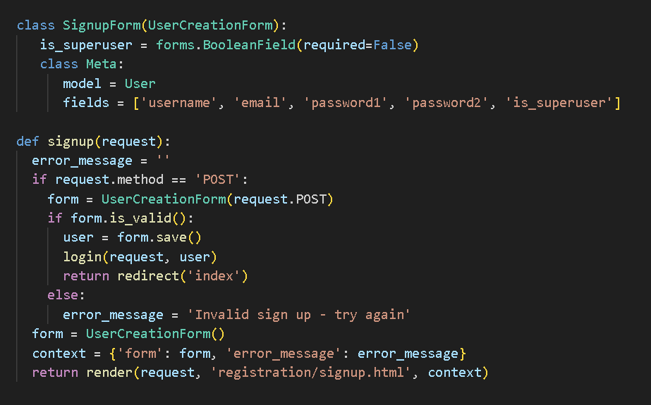

<h1>SEI-Project 3-Employee Management</h1>
<h2>Web Description - Employee Management</h2>

Employee Management is a webpage where company admins can create and manage their employees. Normal employess can sign up and view everyone in the company but are unable to edit any information. With this webpage, managers can list out all employees positions, skills, and their availability schedule and change it as needed. Managers can also then filter out their employees based on their skill and what position they hold in order to find an employee to fill in or to promote.

<h2>Employee Management Picture</h2>
<h4>Welcome page</h4>

There is a simple greeting with four options in the nav bar, an about page, sign up page, login page, and home page all the way on the right with the logo icon

<h4>Admin Logged in</h4>

Admins have options such as Create Employee, Add Skill, Add Position. The first page after log in is the employee index. Here all employees are listed and there is a filter option to select employees with certain skills or positions. 

<h4>Employee Detail</h4>

Once and employee is clicked, their details show up. The employees position, age, years employed, availability, and avatar are shown on a card. Admins can edit and terminate employees . Below, the employees skills are shown and also a list of available new skills to learn. Admins can add and remove skills for an employee

<h2>Admin Add Employee</h2>

<h2>Admin Add Skill</h2>

<h2>All Skills</h2>

<h2>Admin Add Position</h2>

<h2>All Positions</h2>

<h2>About Page</h2>

<h2>Normal User Sign in</h2>

Normal users that sign up do not have the ability to edit or create

<h2>Some Code Snippets</h2>

 This is the code behind the filtering function for employee lookup based upon the skills that they have and what position they hold in the company.

 This is the code behind adding a photo as an avatar for the employees. The choose and upload photo functionality is hidden once a profile picture is chosen.

 This code makes sure that people signing up are not given superuser status, which limits what functions they will have access to.

<h2>Next Steps</h2>

<ul>
    <li>When someone signs up or and employee is created, a user is created that corelates with eachother.</li>
    <li>A user that does not have superuser status will only be able to edit their own details page.</li>
    <li>Filtered employee list shows up as a modal.</li>
